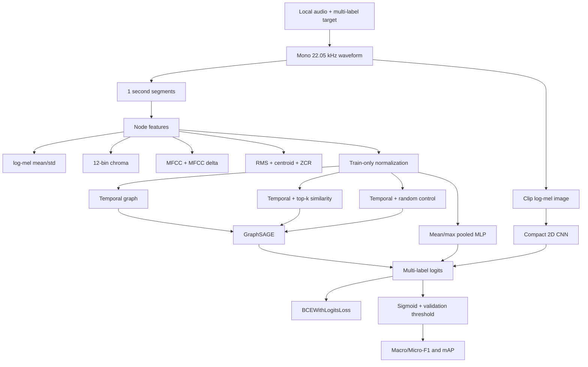

# Task 2 - Jupyter workflow, architecture, and real-data guide

Task 2 is delivered through
`notebooks/task2_gnn_cnn.ipynb`. The notebook calls reusable modules in
`src/task2/`, so every interactive step uses the same tested code as command-line
runs.

## Current completion status

- Audio feature extraction: implemented and tested.
- Temporal, temporal+top-k-similarity, and density-matched random graphs:
  implemented and tested.
- GraphSAGE, pooled-node MLP, and compact log-mel CNN: implemented and tested.
- Train-only node-feature normalization and optional class weights: implemented.
- Validation-only checkpoint and global-threshold selection: implemented.
- Macro-F1, Micro-F1, per-label AP/mAP, runtime, parameter counts, curves,
  checkpoints, and prediction files: implemented.
- Jupyter synthetic end-to-end workflow: executed successfully.
- Real MusicCaps/FMA/GTZAN results: **not yet measured**, because no permitted
  audio dataset is present in the repository.

Synthetic notebook values are pipeline diagnostics and must not appear in the
project report as experimental results.

## Architecture



For default real-audio settings, every segment node has 311 features:

```text
128 log-mel means
+ 128 log-mel standard deviations
+ 12 chroma means
+ 20 MFCC means
+ 20 MFCC-delta means
+ RMS, spectral centroid, zero-crossing rate
= 311 features
```

Temporal edges are bidirectional and always connect consecutive segments.
Similarity edges connect each node to its top-k non-adjacent cosine neighbors
and are made symmetric. The random control preserves temporal edges and adds the
same number of symmetric non-adjacent edges as the similarity graph.

## Repository layout

```text
notebooks/
  task2_gnn_cnn.ipynb       interactive Task 2 workflow
src/task2/
  manifest.py               join MusicCaps metadata/labels to local audio
  features.py               waveform, segments, node features, log-mel
  graphs.py                 temporal/similarity/random graph variants
  preprocess.py             resumable cache + train-only normalization
  dataset.py                processed dataset and batch collation
  models.py                 GraphSAGE, pooled MLP, mel-CNN
  train.py                  training, thresholding, metrics, artifacts
  evaluate.py               checkpoint re-evaluation
tests/task2/
  test_features_graphs_models.py
  test_end_to_end.py
```

## Run in Jupyter or VS Code

1. Create/activate the environment and install dependencies:

```powershell
python -m venv .venv
.venv\Scripts\Activate.ps1
python -m pip install -r requirements.txt
```

2. Open `notebooks/task2_gnn_cnn.ipynb`.
3. Select the `.venv` Python kernel.
4. Leave `USE_SYNTHETIC = True` and run all cells once.
5. Verify the notebook completes feature extraction, graph inspection, model
   shape checks, five synthetic training runs, and a comparison table.

The synthetic workflow writes only to `tmp/task2_notebook_demo/`.

## Switch to real MusicCaps audio

The repository contains MusicCaps metadata but no usable audio. Obtain clips
only when permitted, do not commit or redistribute them, and place them under:

```text
data/raw/musiccaps_audio/
```

Supported names include:

```text
{ytid}.wav
{ytid}_{start_s}.wav
{ytid}_{start_s}_{end_s}.wav
{ytid}-{start_s}.wav
```

Then edit the notebook configuration cell:

```python
USE_SYNTHETIC = False
```

The real-data branch joins:

- `data/raw/musiccaps-public.csv/musiccaps-public.csv`
- `data/processed/musiccaps_tags.csv`
- `data/raw/musiccaps_audio/*`

It refuses to continue if no matching audio exists. This prevents accidental
fabrication of Task 2 results.

## Notebook stages

1. **Environment:** resolve the repository root and import tested modules.
2. **Mode selection:** choose synthetic smoke or real local audio.
3. **Manifest:** bind each sample ID to audio, labels, and a fixed split.
4. **Preprocess:** cache raw features, fit training normalization, then cache all
   graph variants and mel images.
5. **Visual inspection:** show one mel image and segment graph.
6. **Shape check:** verify `[batch, labels]` output for MLP, GNN, and CNN.
7. **Training:** run MLP, CNN, temporal GNN, similarity GNN, and random-edge GNN.
8. **Comparison:** save a measured CSV and display validation/test metrics.
9. **Interpretation:** check leakage, fairness, seeds, and negative results.

## Generated real-data artifacts

```text
data/splits/task2_manifest.json
data/processed/task2/
  normalization.json
  manifest.json
  raw_features/*.pt
  samples/*.pt
results/task2/<model_variant>/
  best_model.pt
  metrics.json
  training_curves.png
  test_predictions.npz
  test_sample_ids.json
results/task2/comparison.csv
```

## Experimental discipline

- Keep the exact same samples, label order, and splits for every model.
- Select graph variant, hidden dimension, epoch, and threshold from validation
  data only.
- Use `evaluate_test=False` (or CLI `--skip-test`) during ablations and evaluate
  the final frozen configuration on test once.
- Run three seeds for selected GNN and CNN models.
- Report parameter count and runtime with Macro-F1, Micro-F1, and mAP.
- Compare temporal, similarity, and random edges; otherwise a GNN gain cannot be
  attributed to meaningful graph structure.
- Compare with the pooled MLP; otherwise a GNN gain may come only from node
  features or parameter count.
- If GraphSAGE does not beat CNN or the random graph, report the negative result
  and analyze graph density, features, and oversmoothing.

## Command-line equivalents

Run from the repository root in your activated Python environment. The command
`python -m src.task2` lists entry points; it does not start training.

For real audio in `data/raw/musiccaps_audio/`, run these commands in order
(stop if a command fails):

```powershell
python -m src.task2.manifest --metadata-csv data/raw/musiccaps-public.csv/musiccaps-public.csv --labels-csv data/processed/musiccaps_tags.csv --audio-dir data/raw/musiccaps_audio --output data/splits/task2_manifest.json
python -m src.task2.preprocess --manifest data/splits/task2_manifest.json --output-dir data/processed/task2
python -m src.task2.train --manifest data/processed/task2/manifest.json --output-dir results/task2/gnn_similarity --model gnn --graph-variant temporal_similarity --epochs 30 --device auto --skip-test
```

Compare CNN and MLP by changing `--model` to `cnn` or `mlp` and assigning each
run a distinct `--output-dir`. For GNN graph ablations, set `--graph-variant`
to `temporal` or `random`. Keep `--skip-test` while selecting configurations.
After choosing the final configuration using validation results:

```powershell
python -m src.task2.evaluate --checkpoint results/task2/gnn_similarity/best_model.pt --manifest data/processed/task2/manifest.json --split test --device auto --output results/task2/gnn_similarity/final_test.json
```

Evaluation saves metrics, prediction arrays, and a matching `.sample_ids.json`
file. It rejects manifests whose label names or order differ from the checkpoint.

Preprocessing can be rerun after manifest edits: it refreshes labels and splits
before fitting training normalization and hashes audio content to invalidate
changed sources. Older caches without a source fingerprint are rebuilt once.
Hashing requires reading each audio file even when its features are reused.

For a quick terminal check after running the synthetic notebook once:

```powershell
python -m src.task2.train --manifest tmp/task2_notebook_demo/processed/manifest.json --output-dir tmp/task2_terminal/gnn --model gnn --hidden-dim 32 --batch-size 6 --epochs 2 --device auto
```

Synthetic results remain pipeline checks only. Use a fresh output directory for
each experiment so saved artifacts from different runs do not get mixed.

The notebook is the primary interface, but every stage is executable directly:

```powershell
python -m src.task2
python -m src.task2.manifest --help
python -m src.task2.preprocess --help
python -m src.task2.train --help
python -m src.task2.evaluate --help
```

Run all offline tests with:

```powershell
python -m unittest discover -s tests -v
```
