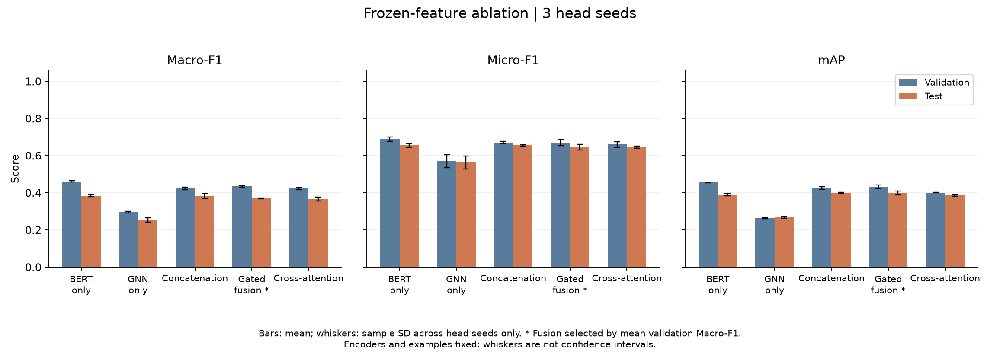
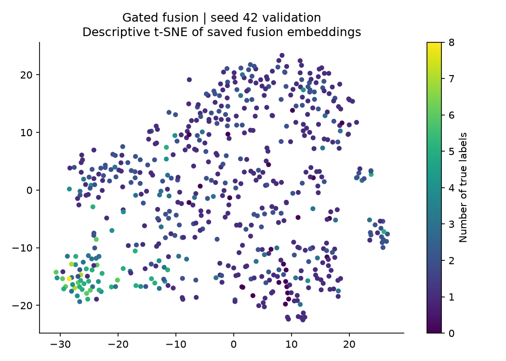

# Task 3 saved-prediction analysis

Frozen selected fusion: **gated**. Head seeds: 42, 43, 44. Test examples per run: 606.

## Frozen five-mode comparison

Mean ± sample SD across head seeds.

| Mode | Validation Macro-F1 | Test Macro-F1 | Test Micro-F1 | Test mAP |
|---|---:|---:|---:|---:|
| bert | 0.4621 ± 0.0040 | 0.3850 ± 0.0058 | 0.6564 ± 0.0105 | 0.3892 ± 0.0058 |
| gnn | 0.2967 ± 0.0050 | 0.2539 ± 0.0119 | 0.5632 ± 0.0352 | 0.2680 ± 0.0036 |
| concat | 0.4228 ± 0.0070 | 0.3839 ± 0.0124 | 0.6560 ± 0.0034 | 0.3994 ± 0.0038 |
| gated | 0.4353 ± 0.0048 | 0.3705 ± 0.0013 | 0.6466 ± 0.0149 | 0.3995 ± 0.0110 |
| cross_attention | 0.4232 ± 0.0058 | 0.3665 ± 0.0102 | 0.6453 ± 0.0061 | 0.3861 ± 0.0048 |

## Paired test comparisons

Deltas are selected fusion minus the named control, computed within each declared seed. Improved/worse/tie counts compare per-example F1 at each model's saved validation threshold.

| Control | Δ Macro-F1 mean ± SD | Δ Micro-F1 mean ± SD | Δ mAP mean ± SD | Improved / worse / tied seed-example pairs |
|---|---:|---:|---:|---:|
| bert | -0.0145 ± 0.0054 | -0.0098 ± 0.0173 | +0.0103 ± 0.0168 | 438 / 452 / 928 |
| gnn | +0.1166 ± 0.0124 | +0.0833 ± 0.0434 | +0.1315 ± 0.0109 | 715 / 298 / 805 |
| concat | -0.0134 ± 0.0126 | -0.0094 ± 0.0115 | +0.0000 ± 0.0120 | 267 / 332 / 1219 |

## Highest selected-fusion AP

| Label | Test positives | AP mean ± SD |
|---|---:|---:|
| Music (`/m/04rlf`) | 497 | 0.9394 ± 0.0032 |
| Didgeridoo (`/m/02bxd`) | 9 | 0.9040 ± 0.0168 |
| Wind instrument, woodwind instrument (`/m/085jw`) | 30 | 0.8688 ± 0.0111 |
| Brass instrument (`/m/01kcd`) | 14 | 0.7749 ± 0.0195 |
| Guitar (`/m/0342h`) | 58 | 0.6776 ± 0.0095 |
| Plucked string instrument (`/m/0fx80y`) | 48 | 0.5999 ± 0.0271 |
| Acoustic guitar (`/m/042v_gx`) | 16 | 0.4835 ± 0.0351 |
| New-age music (`/m/02v2lh`) | 6 | 0.4781 ± 0.0637 |
| Keyboard (musical) (`/m/05148p4`) | 15 | 0.4446 ± 0.0212 |
| Musical instrument (`/m/04szw`) | 80 | 0.4408 ± 0.0072 |

## Lowest selected-fusion AP

| Label | Test positives | AP mean ± SD |
|---|---:|---:|
| Pop music (`/m/064t9`) | 7 | 0.0316 ± 0.0051 |
| Funk (`/m/02x8m`) | 11 | 0.1514 ± 0.0408 |
| Song (`/m/074ft`) | 13 | 0.1692 ± 0.0089 |
| Independent music (`/m/05rwpb`) | 12 | 0.2017 ± 0.0374 |
| Music of Africa (`/m/0164x2`) | 4 | 0.2055 ± 0.0559 |
| Blues (`/m/0155w`) | 9 | 0.2064 ± 0.0237 |
| Electronic music (`/m/02lkt`) | 23 | 0.2173 ± 0.0211 |
| Rock music (`/m/06by7`) | 14 | 0.2288 ± 0.0312 |
| Traditional music (`/m/02p0sh1`) | 8 | 0.2494 ± 0.0615 |
| Electric guitar (`/m/02sgy`) | 19 | 0.2615 ± 0.0101 |

## Interpretation limits

- All comparisons are descriptive; no statistical significance is claimed.
- Seeds vary fusion-head initialization and training order only; encoders and features are fixed. Sample standard deviation across head seeds does not measure dataset or encoder uncertainty.
- The selected fusion and every decision threshold were frozen using validation data before test evaluation. Test results are not used to select, retrain, or tune models.
- Per-example F1 uses each run's saved validation threshold and zero_division=0. Seed-example counts repeat the same test examples across head seeds and are not independent observations.
- Average precision is undefined for labels with no test positives; these labels are excluded from AP rankings and mAP, but retained in per_label.csv. Low-support label rankings can be unstable.

Exact per-seed paired values and counts are in `failure_analysis.json`; all labels and modes are in `per_label.csv`. No test outcomes alter the frozen selection.

## Selected fusion embeddings

Seed 42 validation representations of gated; descriptive t-SNE, not a quality metric.

