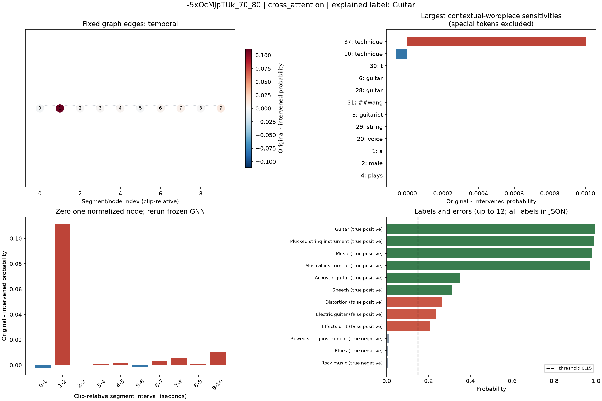
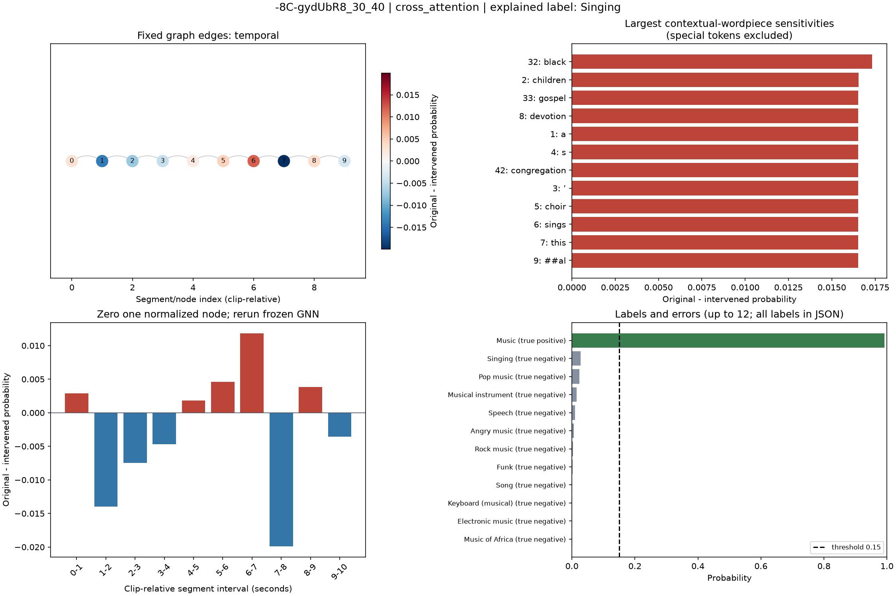
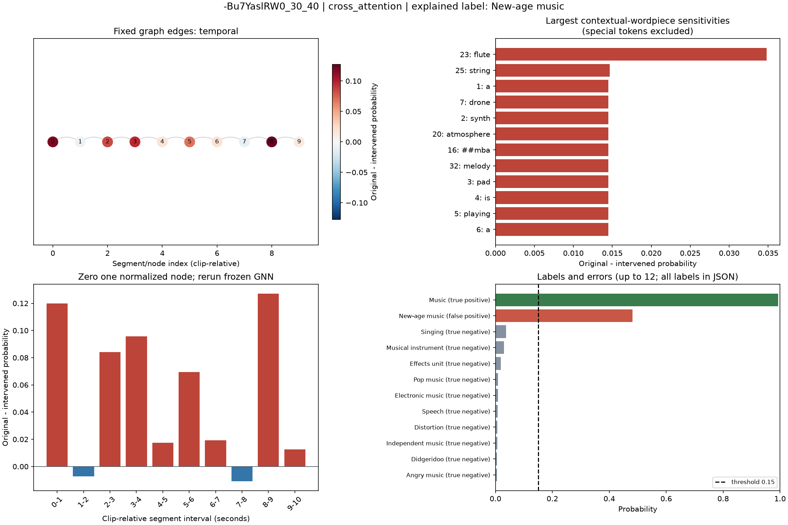

# Task 3 validation case studies

Checkpoint mode: **cross_attention**. First three validation rows in frozen-cache order; no outcome filtering. The supplied head is an advanced-fusion diagnostic and is not necessarily the validation winner.

Fixed focal-label rule: highest-probability label excluding the generic AudioSet Music label (/m/04rlf); fallback to the highest-probability label if Music is the only label. All label probabilities and intervention deltas are retained in JSON.

Delta = original probability minus probability after intervention; positive means the intervention lowers the score. Each intervention is independent. Graph interventions replace one normalized node-feature vector with zero (the training feature mean), retaining every edge, and rerun the frozen GNN. Text interventions zero one cached contextual BERT vector, preserving the attention mask and other vectors. They do not delete or mask the raw word, and contextual information remains in other vectors. These out-of-distribution representation checks are neither causal word/audio attributions nor proof that a particular instrument occurs in a segment. Sensitivities need not add up.

Cross-attention reads all unmasked contextual vectors; wordpiece sensitivity still is not raw-word importance.

## Case 1: -5xOcMJpTUk_70_80

A male guitarist plays the guitar and speaks about technique in this online video tutorial. The male voice is strong and commanding, along with guitar string twang sounds, clearly demonstrating the technique. The audio quality is mediocre.

Explained label: **Guitar** (`/m/0342h`); probability **0.9940**, target **1**, status **true_positive**. Threshold: 0.1500.

- True positive: Music (0.983), Musical instrument (0.972), Guitar (0.994), Plucked string instrument (0.993), Speech (0.312), Acoustic guitar (0.351).
- False positive: Effects unit (0.207), Electric guitar (0.236), Distortion (0.266).
- False negative: none.

Representation trace: cached normalized segment features → frozen GraphSAGE mean/max readout; cached contextual BERT vectors → frozen fusion head → sigmoid score.

| Segment (clip seconds) | Original − intervened probability |
|---|---:|
| 1–2 | +0.111208 |
| 9–10 | +0.010107 |
| 7–8 | +0.005372 |

| Contextual wordpiece position / token | Original − intervened probability |
|---|---:|
| 37 / `technique` | +0.001006 |
| 10 / `technique` | -0.000062 |
| 30 / `t` | -0.000002 |
| 6 / `guitar` | +0.000002 |
| 28 / `guitar` | -0.000001 |

## Case 2: -8C-gydUbR8_30_40

A children’s choir sings this devotional melody. The song is medium tempo with a steady bass line, drumming rhythm and clapping percussion. The song is black gospel choral music played in front of a live congregation. The audio quality is very poor.

Explained label: **Singing** (`/m/015lz1`); probability **0.0277**, target **0**, status **true_negative**. Threshold: 0.1500.

- True positive: Music (0.993).
- False positive: none.
- False negative: none.

Representation trace: cached normalized segment features → frozen GraphSAGE mean/max readout; cached contextual BERT vectors → frozen fusion head → sigmoid score.

| Segment (clip seconds) | Original − intervened probability |
|---|---:|
| 7–8 | -0.019899 |
| 1–2 | -0.013964 |
| 6–7 | +0.011852 |

| Contextual wordpiece position / token | Original − intervened probability |
|---|---:|
| 32 / `black` | +0.017318 |
| 2 / `children` | +0.016549 |
| 33 / `gospel` | +0.016519 |
| 8 / `devotion` | +0.016513 |
| 1 / `a` | +0.016513 |

## Case 3: -Bu7YaslRW0_30_40

A synth pad is playing a drone sound in the lower mid range. Cymbals are creating atmosphere while a flute/string/brass sound is playing a melody. The whole recording is full of reverb. This song may be playing in a forest documentary.

Explained label: **New-age music** (`/m/02v2lh`); probability **0.4821**, target **0**, status **false_positive**. Threshold: 0.1500.

- True positive: Music (0.994).
- False positive: New-age music (0.482).
- False negative: none.

Representation trace: cached normalized segment features → frozen GraphSAGE mean/max readout; cached contextual BERT vectors → frozen fusion head → sigmoid score.

| Segment (clip seconds) | Original − intervened probability |
|---|---:|
| 8–9 | +0.127212 |
| 0–1 | +0.119902 |
| 3–4 | +0.095744 |

| Contextual wordpiece position / token | Original − intervened probability |
|---|---:|
| 23 / `flute` | +0.034791 |
| 25 / `string` | +0.014684 |
| 1 / `a` | +0.014482 |
| 7 / `drone` | +0.014479 |
| 2 / `synth` | +0.014474 |

