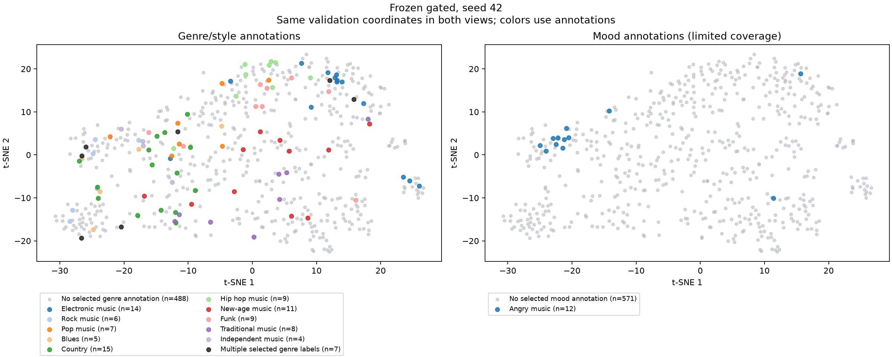

# Genre and mood embedding views

Frozen gated, seed 42. 583 validation examples.

Overview: one selected annotation gets its named color; multiple selected annotations get a separate overlap color; zero selected annotations means no selected annotation, not a confirmed negative. Per-label genre panels retain every overlapping positive.

- The chosen genre group includes music styles; it is an explicit analysis mapping, not a newly annotated genre taxonomy.
- Only Angry music is an explicit mood target in the selected vocabulary. This view cannot establish broader mood separation.
- Missing positive annotations must not be interpreted as confirmed absence of a genre or mood.
- t-SNE is a descriptive projection and does not establish causal explanations or generalization.

`metadata.json` records the complete mapping, source hash and positive support. `sample_annotations.csv` and `embedding_coordinates.npz` preserve labels, IDs and coordinates.
