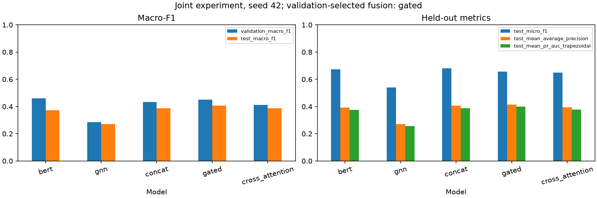

# Task 3 joint-fusion results

Completed five-mode joint fine-tuning experiment, seed 42. Validation selects **bert** overall and **gated** among fusion models.

## Protocol

Configured maximum 3 epochs; patience 2; batch size 8; projection width 64. Initial heads: Saved per-mode frozen heads. The final 1 transformer block(s), GraphSAGE and active head train using live encoder forwards. Lower text layers remain frozen. Checkpoints record active encoder/head updates and unchanged frozen weights.

All modes share paired IDs, label order and splits. Validation alone selects epochs, thresholds and mode. All predeclared modes are then evaluated on held-out test clips. This is one joint-training seed; the earlier three-seed frozen experiment is separate. Historical encoder pretraining cohorts differ, as documented in the run guide.

## Ablation matrix

| mode | best_epoch | threshold | validation_macro_f1 | test_macro_f1 | test_micro_f1 | test_mean_average_precision | test_mean_pr_auc_trapezoidal |
| --- | --- | --- | --- | --- | --- | --- | --- |
| bert | 3 | 0.2000 | 0.4602 | 0.3727 | 0.6739 | 0.3922 | 0.3751 |
| gnn | 2 | 0.1000 | 0.2861 | 0.2700 | 0.5398 | 0.2706 | 0.2562 |
| concat | 3 | 0.2500 | 0.4326 | 0.3877 | 0.6810 | 0.4056 | 0.3884 |
| gated | 1 | 0.1500 | 0.4496 | 0.4073 | 0.6563 | 0.4148 | 0.3986 |
| cross_attention | 1 | 0.2000 | 0.4104 | 0.3867 | 0.6503 | 0.3943 | 0.3777 |

mAP is mean per-label average precision. Trapezoidal mean PR-AUC is a separate metric. Both average only labels with positive evaluation support.

## Failure analysis

Selected gated versus bert: test Macro-F1 difference +0.0347; per-example F1 improves for 124 clips, worsens for 159, and ties for 323. These descriptive counts use each model's saved threshold and are not significance tests.

Selected gated versus gnn: test Macro-F1 difference +0.1374; per-example F1 improves for 286 clips, worsens for 85, and ties for 235. These descriptive counts use each model's saved threshold and are not significance tests.

Lowest selected-fusion per-label test F1 (ties ordered by support and label ID):

| name | support | f1 | average_precision | false_positives | false_negatives |
| --- | --- | --- | --- | --- | --- |
| Pop music | 7 | 0.0000 | 0.0267 | 8 | 7 |
| Song | 13 | 0.1143 | 0.1522 | 20 | 11 |
| Funk | 11 | 0.1429 | 0.2208 | 2 | 10 |
| Bowed string instrument | 8 | 0.1600 | 0.3373 | 15 | 6 |
| Independent music | 12 | 0.1905 | 0.2092 | 7 | 10 |
| Electronic music | 23 | 0.2449 | 0.2040 | 20 | 17 |
| Traditional music | 8 | 0.2727 | 0.2632 | 11 | 5 |
| Blues | 9 | 0.2857 | 0.2612 | 9 | 6 |

Low-support labels have unstable estimates. Incomplete AudioSet positives can make sensible predictions count as false positives. Captions often directly describe instruments, while ten audio graph segments compress temporal detail; these are plausible limitations, not established causal explanations of an individual error. Missing-audio selection and the absence of artist-disjoint splits limit generalization. A negative fusion result is reported without selecting a replacement using test scores.

[Three fixed validation cases](cases.md) include captions, annotations, predicted labels, errors and probabilities. They describe observed model behavior; attention weights do not establish causal importance.

## Remaining scope qualifications

MusicCaps is a substitute for the assignment's named datasets; instructor acceptance remains undocumented. Genre/mood t-SNE uses explicit positive AudioSet annotations, retains genre overlap and displays missing annotations. Only Angry music is available as a selected mood label, so broad mood coverage cannot be claimed.

The run's per-mode training_curves.png files contain measured BCE and validation Macro-F1 curves. The semantic_plots directory is generated separately using the saved validation-selected fusion embeddings.
